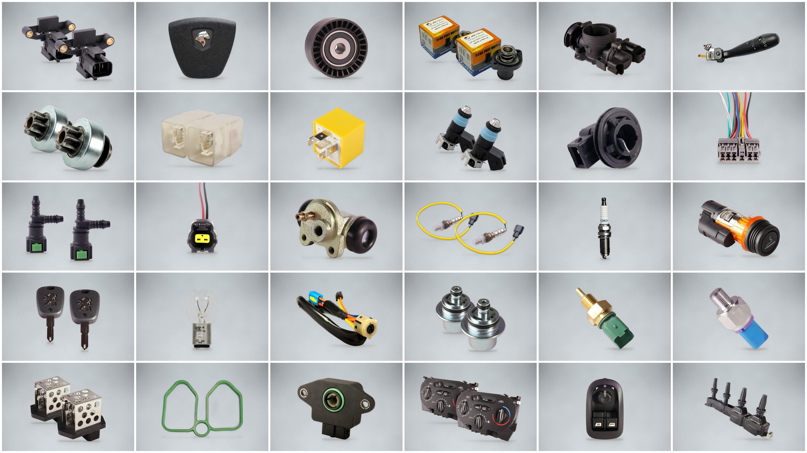

# تصاویر محصولات آریزون یدک

**537 محصول** در **38 دسته** — مجموعاً **2047 عکس** آماده‌ی آپلود در سایت.

همه‌ی عکس‌ها با پس‌زمینه‌ی استودیویی خاکستری ساخته شده‌اند؛ همان رنگ، نور و سایه‌ی نرمِ عکس‌های فعلی سایت، تا کنار هم کاملاً یک‌دست دیده شوند.



## دانلود

روی دکمه‌ی سبز **Code** در بالای صفحه‌ی همین شاخه بزنید و **Download ZIP** را انتخاب کنید؛ همه‌ی عکس‌ها در پوشه‌ی `تصاویر محصولات` هستند.

## مشخصات عکس‌ها

| مورد | مقدار |
|---|---|
| ابعاد | ۱۵۰۰ × ۱۰۰۰ پیکسل (نسبت ۳:۲، همان نسبت عکس‌های نمونه‌ی سایت) |
| فرمت | JPG با کیفیت بالا (به‌طور میانگین ۱۲۰ کیلوبایت و حداکثر ۴۱۰ کیلوبایت؛ سقف آپلود سایت ۴ مگابایت است) |
| پس‌زمینه | خاکستری سرد استودیویی با نور ملایم وسط و سایه‌ی نرم زیر قطعه |
| کیفیت | عکس‌های کوچک و کم‌کیفیت با هوش مصنوعی (Real-ESRGAN) بزرگ و شارپ شده‌اند؛ دور قطعه‌ها بدون هاله‌ی سفید بریده شده است |
| جای قطعه | قطعه وسط کادر و با فاصله از لبه‌ها است تا در کارت موبایل، کارت دسکتاپ و گالری محصول بریده نشود |

## ساختار پوشه‌ها و نام فایل‌ها

```
تصاویر محصولات/
└── <دسته>/
    └── <نام محصول>/
        ├── <نام محصول> - 01 تکی.jpg          ← عکس اصلی (اول آپلود شود)
        ├── <نام محصول> - 02 دوتایی.jpg
        ├── <نام محصول> - 03 سه تایی.jpg
        └── <نام محصول> - 04 نمای نزدیک.jpg
```

شماره‌ی اول نام هر فایل ترتیب نمایش در گالری محصول است. **عکس 01 را اول آپلود کنید**؛ کارت محصول در سایت همیشه عکس اول را نشان می‌دهد.

| نوع عکس | توضیح |
|---|---|
| تکی | یک عدد از قطعه، عکس اصلی محصول |
| دوتایی / سه تایی | چند عدد از همان قطعه با عمق و سایه‌ی طبیعی |
| نمای نزدیک | نمای بزرگ‌شده برای دیدن جزئیات، فیش‌ها و نوشته‌ها |
| مجموعه کامل | برای کیت‌ها و ستها (مثل ست قفل و سوییچ، ست وایر، مجموعه ایربگ) که چند قطعه‌ی متفاوت دارند و تکثیر نمی‌شوند |
| تکی قطعه 1، 2، … | هر قطعه‌ی کیت به‌تنهایی (مثلاً ایربگ چپ و راست جدا) |
| چندتایی | برای عکس‌هایی که از اول چند عدد یکسان داشتند (مثلاً ۴ شمع)؛ عکس «تکی» از یکی از همان‌ها جدا شده |
| نمای دیگر | عکس دوم همان محصول که در فایل‌ها جدا آمده بود |

فهرست کامل محصولات (دسته، نام، تعداد عکس، عکس اصلی، فایل اصلی در زیپ) در فایل `تصاویر محصولات/فهرست محصولات.csv` هست که با اکسل باز می‌شود.

## دسته‌ها

| دسته | تعداد محصول | تعداد عکس |
|---|---|---|
| آفتامات دینام | 25 | 100 |
| استپ موتور | 7 | 28 |
| ایربگ | 21 | 82 |
| بلبرینگ جات و فولی هرزگرد | 21 | 85 |
| بوق | 3 | 12 |
| ترموستات درب رادیات | 6 | 24 |
| تسمه دینام تسمه تایم | 4 | 16 |
| تقویت شیشه بالابر و پمپ درب یونیت | 11 | 44 |
| جعبه فیوز | 6 | 25 |
| دریچه گاز کامل | 6 | 24 |
| دسته راهنما و دسته برف پاک کن | 11 | 44 |
| دنده استارت | 3 | 12 |
| رله جات | 20 | 77 |
| سوزن انژکتور | 12 | 48 |
| سوکت | 128 | 496 |
| سیلندر چرخ عقب و پیچ کالپر | 4 | 16 |
| سیم اکسیژن | 13 | 52 |
| سیم دور موتور | 6 | 24 |
| سیم کشی | 8 | 30 |
| شاسی لای درب | 7 | 28 |
| شمع | 1 | 3 |
| شیر فرمان و چهار شاخه فرمان | 7 | 28 |
| فندک | 6 | 24 |
| قاب ریموت | 10 | 40 |
| لامپ | 9 | 36 |
| مغزی سوییچ قفل درب | 22 | 58 |
| مغزی پمپ و سوخت رسانی | 22 | 85 |
| مهره آب و مهره روغن | 15 | 60 |
| مهره استپ ترمز و مهره دنده عقب | 10 | 40 |
| موتور فن و مقاومت فن | 9 | 36 |
| واشر سر سیلندر منیفولد اورینگ جات | 21 | 68 |
| وایر شمع | 13 | 26 |
| پتانسیومتر دریچه گاز | 13 | 52 |
| پمپ شیشه شور | 5 | 20 |
| پنل بخاری | 3 | 12 |
| کلید شیشه بالابر | 13 | 52 |
| کلید فلاشر گرمکن پرژکتور بخاری | 21 | 82 |
| کوئل | 15 | 58 |

## نام‌هایی که مرتب شدند

فایل‌هایی که اسمشان کد، ناقص یا غلط تایپی بود، با نام خوانا ذخیره شدند:

| دسته | نام فایل اصلی | نام جدید |
|---|---|---|
| آفتامات دینام | Aa01 (46) | آفتامات دینام - کد Aa01-46 |
| آفتامات دینام | Aa01 (53) | آفتامات دینام - کد Aa01-53 |
| آفتامات دینام | افتا | آفتامات دینام - مدل 1 |
| آفتامات دینام | افتامات | آفتامات دینام - مدل 2 |
| آفتامات دینام | ماکویی | آفتامات دینام ماکویی - مدل 1 |
| آفتامات دینام | ماکویی2 | آفتامات دینام ماکویی - مدل 2 |
| آفتامات دینام | مدول بخاری قدیم (2) | مدول بخاری قدیم |
| ایربگ | ایربگ راست پارس خاگستری | ایربگ راست پارس خاکستری |
| ایربگ | ایربگ راست پژو پارس -آریسان مشکی | ایربگ راست پژو پارس - آریسان مشکی |
| ایربگ | ایربگ چپ  مشکی405 | ایربگ چپ 405 مشکی |
| ایربگ | مجموعه ایربگ های سورن بدون قابل | مجموعه ایربگ های سورن بدون قاب |
| ایربگ | مجموعه ایربگ چپ و کیسه هوا سرنشین   بدون قاب مشترک در 3مدل ایمن کروز و اندیشه | مجموعه ایربگ چپ و کیسه هوا سرنشین بدون قاب (ایمن، کروز و اندیشه) |
| ایربگ | کیسه هوا سرنشین دنا بدون قاب،کروز | کیسه هوا سرنشین دنا بدون قاب (کروز) |
| بلبرینگ جات و فولی هرزگرد | بلبرینگ | بلبرینگ - مدل 1 |
| بلبرینگ جات و فولی هرزگرد | بلبل | بلبرینگ - مدل 2 |
| تسمه دینام تسمه تایم | d (33) | تسمه تایم |
| تسمه دینام تسمه تایم | d (34) | تسمه دینام شیاردار |
| تسمه دینام تسمه تایم | d (35) | تسمه دینام - مدل 1 |
| تسمه دینام تسمه تایم | d (36) | تسمه دینام - مدل 2 |
| دنده استارت | d (46) | دنده استارت - مدل 1 |
| دنده استارت | d (47) | دنده استارت - مدل 2 |
| دنده استارت | d (48) | دنده استارت - مدل 3 |
| رله جات | رله فم 405 شیشه ای | رله فن 405 شیشه ای |
| رله جات | رله فن پراید کاربرات | رله فن پراید کاربراتور |
| سوزن انژکتور | ssat-no-bg | سوزن انژکتور SSAT |
| سوزن انژکتور | اس دی-no-bg | سوزن انژکتور SD |
| سوزن انژکتور | ال90-no-bg | سوزن انژکتور ال 90 |
| سوزن انژکتور | ریو-no-bg | سوزن انژکتور ریو |
| سوزن انژکتور | ساژم مشکی-no-bg | سوزن انژکتور ساژم مشکی |
| سوزن انژکتور | سوکت بیضی-no-bg | سوزن انژکتور سوکت بیضی |
| سوزن انژکتور | مزدا-no-bg | سوزن انژکتور مزدا |
| سوزن انژکتور | پراید ساژم مربع-no-bg | سوزن انژکتور پراید ساژم مربع |
| سوکت | جالامپ | جا لامپی - مدل 1 |
| سوکت | جالامپی2 | جا لامپی - مدل 2 |
| سوکت | سه فیش دویی | سوکت سه فیش دوویی - مدل 2 |
| سوکت | سوکت رله فن پراید کاربرات | سوکت رله فن پراید کاربراتور |
| سوکت | سوکت سمند LX -شش فیش پمپ بنزین | سوکت سمند LX - شش فیش پمپ بنزین |
| سوکت | سوکت سوزن نیسان دیزل -مهره آب | سوکت سوزن نیسان دیزل - مهره آب |
| سوکت | سوکت مقاوت بخاری 206 | سوکت مقاومت بخاری 206 |
| سوکت | سوکت موتور فن پراید 2دور نری | سوکت موتور فن پراید 2 دور نری |
| سوکت | سوکت کوئل 2000-مدول بخاری | سوکت کوئل 2000 - مدول بخاری |
| سوکت | سوکت کوئل زیمنس مشکی -طوسی | سوکت کوئل زیمنس مشکی - طوسی |
| سوکت | سیم | سیم سنسور |
| سوکت | مهره دنده | سوکت مهره دنده |
| شیر فرمان و چهار شاخه فرمان | کامل 206پایه فیلتر | پایه فیلتر کامل 206 |
| فندک | فندک | فندک - مدل عمومی |
| مغزی سوییچ قفل درب | سوییپ درب 206 | سوییچ درب 206 |
| مغزی پمپ وسوخت رسانی | پایه فیلتر روغن فزی تیپ 2 | پایه فیلتر روغن فلزی تیپ 2 |
| مهره استپ ترمز و مهره دنده عقب | مهره | مهره - مدل عمومی |
| موتور فن و مقاومت فن | موتور فن خاری وپیچی  405 | موتور فن خاری و پیچی 405 |
| واشر سر سیلندر منیفولد اورینگ جات | واشر درب سوپاپxup | واشر درب سوپاپ XUP |
| پتانسیومتر دریچه گاز | سنسور دریچه گاز 206 پلاستیکی-فلزی | سنسور دریچه گاز 206 پلاستیکی - فلزی |
| کوئل | tu3 | کوئل TU3 |

## نکته‌ها

- در مخزن **۵ فایل زیپ** بود (پارت ۱ تا ۵) با ۵۴۰ عکس؛ همه بررسی و ساخته شدند.
- «واشر درب سوپاپ XUP» (jpg و webp) و «واشر گلویی 405» (jpg و jfif) دو بار با یک عکس آمده بودند؛ هرکدام یک بار ساخته شد.
- دو عکس مختلف «بلبرینگ تایم ثابت سمند ملی» در یک محصول آمده‌اند (عکس دوم = «نمای دیگر»).
- چند محصول در دو دسته تکرار شده‌اند (مثلاً «خار کامپیوتر» و «سیم کشی SL96» هم در «سوکت» هم در «سیم کشی»)؛ طبق پوشه‌بندی خودتان در هر دو دسته گذاشته شدند.
- عکس «کابل منفی باطری» (دسته سوکت) و «کابل باطری مثبت» (دسته سیم کشی) دقیقاً یکی است؛ یکی از این دو اسم اشتباه است، لطفاً چک کنید.
- برای سوکت‌هایی که سیمشان در عکس اصلی از لبه‌ی کادر بیرون زده بود، سیم از بالای کادر بیرون می‌رود تا بریدگی سیم طبیعی دیده شود. اگر سوکتی سیم خیلی بلند داشت و سه‌تایی‌اش ریز می‌شد، فقط تکی، دوتایی و نمای نزدیک ساخته شد.

